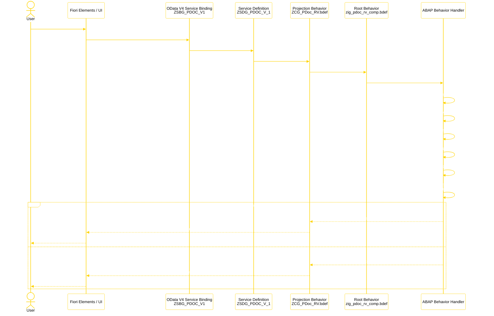
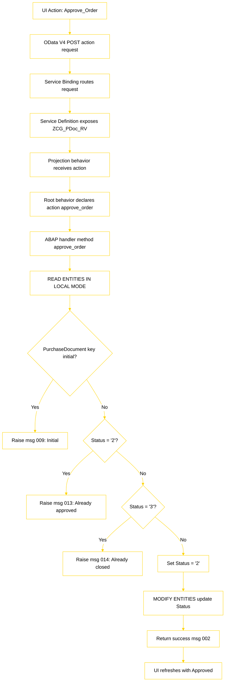
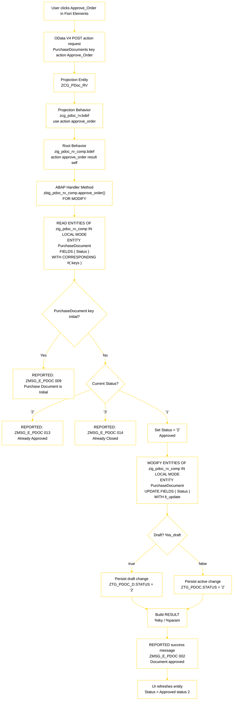
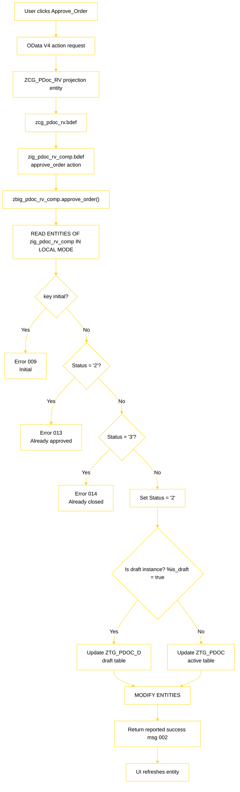
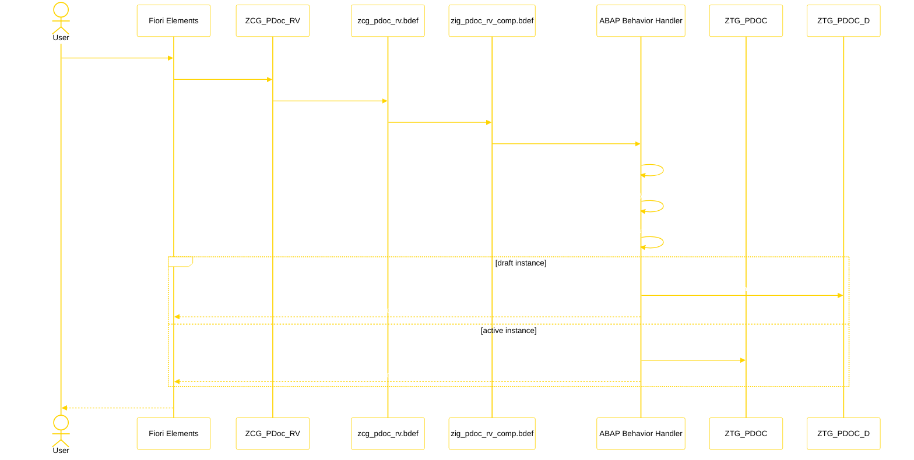
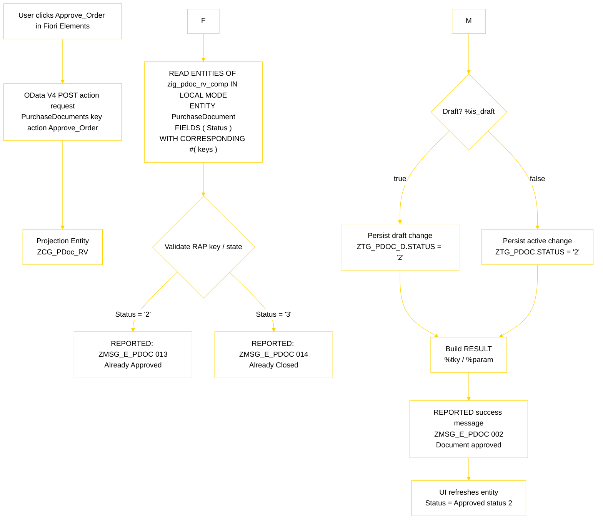

# Approve_Order — Technical RAP Flow

This document captures everything covered about what happens when a user clicks **Approve_Order** in the RAP purchase document application, including the technical RAP flow, all diagrams, flowcharts, [...]

## End-to-end technical overview

When the user clicks **Approve_Order**, the request travels through the RAP stack:

- **Fiori Elements UI** triggers an OData V4 action call
- **Service Binding** `ZSBG_PDOC_V1` receives the request
- **Service Definition** `ZSDG_PDOC_V_1` exposes the transactional entity
- **Projection View** `ZCG_PDoc_RV` maps the request into the consumption model
- **Projection Behavior** `zcg_pdoc_rv.bdef` re-exposes the action
- **Root Behavior** `zig_pdoc_rv_comp.bdef` owns the business object action
- **Behavior Handler** `zbig_pdoc_rv_comp.approve_order()` performs the state transition
- **Persistence** is updated in `ZTG_PDOC` or `ZTG_PDOC_D` depending on draft state

## Sequence diagram — business-level flow

```text
User
  │
  │ clicks Approve_Order
  ▼
Fiori UI
  │
  │ sends OData V4 action request
  ▼
Service Binding (ZSBG_PDOC_V1)
  │
  ▼
Service Definition (ZSDG_PDOC_V_1)
  │
  ▼
Projection View / Behavior
ZCG_PDoc_RV
  │
  │ use action approve_order
  ▼
Composition Root Behavior
ZIG_PDoc_RV_COMP
  │
  ▼
Behavior Handler
zbig_pdoc_rv_comp.approve_order( )
  │
  ├─ Read current PurchaseDocument status
  ├─ Check key is not initial
  ├─ If status = '2' → error 013 (already approved)
  ├─ If status = '3' → error 014 (already closed)
  └─ Otherwise set Status = '2'
  │
  ▼
MODIFY ENTITIES
  │
  ├─ persist updated Status
  └─ return result + success message 002
  │
  ▼
UI refreshes
  │
  └─ shows Status = Approved status 2
```

## Sequence diagram — technical RAP flow



## Flowchart — technical RAP internals



## Flowchart — exact status transition rules



## Draft vs active path





## Annotated single-page RAP diagram



## Runtime callouts

- **`keys`**: RAP transactional keys passed into the action
- **`%tky`**: internal transactional key used to correlate result rows
- **`%is_draft`**: indicates whether the action targets draft or active data
- **`READ ENTITIES`**: retrieves current BO state through RAP, not direct SQL
- **`MODIFY ENTITIES`**: performs the state transition through the behavior layer
- **`result` / `failed` / `reported`**: RAP response channels for success and errors

## Status transition summary

- `'1'` → `'2'` : allowed
- `'2'` → `'2'` : blocked, error 013
- `'3'` → `'2'` : blocked, error 014

## Related architecture components

- UI entity: `ZCG_PDoc_RV`
- Projection behavior: `zcg_pdoc_rv.bdef`
- Root behavior: `zig_pdoc_rv_comp.bdef`
- Behavior handler: `zbig_pdoc_rv_comp.approve_order()`
- Persistence: `ZTG_PDOC` and `ZTG_PDOC_D`
