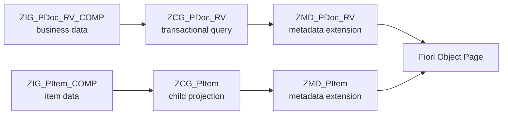
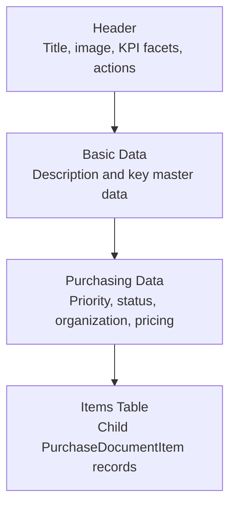
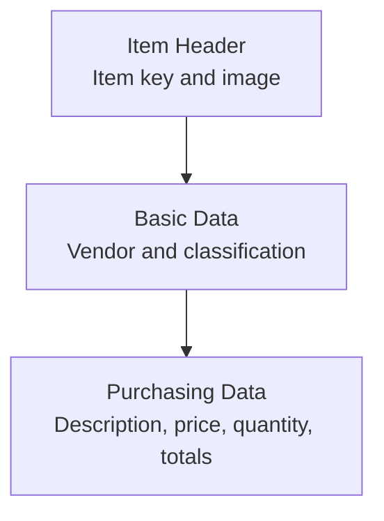

# CDS Metadata Extension Deep Dive

This document explains how the CDS metadata extensions in this RAP application shape the Fiori UI without changing the underlying data model.

## At A Glance

| Layer | ABAP Object | What it controls | Developer takeaway |
|---|---|---|---|
| Basic / composite model | [ZIG_PDOC_RV_COMP](src/zig_pdoc_rv_comp.ddls.asddls) | Business data, compositions, calculated fields | This is the data foundation; no UI behavior yet |
| Consumption projection | [ZCG_PDOC_RV](src/zcg_pdoc_rv.ddls.asddls) | Transactional query surface, field exposure, value help hooks | This is the contract the UI reads |
| Metadata extension | [ZMD_PDOC_RV](src/zmd_pdoc_rv.ddlx.asddlxs) | Header, facets, actions, sections, list items | This is where the object page layout is shaped |
| Child item model | [ZIG_PITEM_COMP](src/zig_pitem_comp.ddls.asddls) / [ZCG_PITEM](src/zcg_pitem.ddls.asddls) | Item data and child projection | This feeds the item section in the object page |



## Scope

The deep dive focuses on the two UI-facing metadata extension artifacts:

- [src/zmd_pdoc_rv.ddlx.asddlxs](src/zmd_pdoc_rv.ddlx.asddlxs)
- [src/zmd_pitem.ddlx.asddlxs](src/zmd_pitem.ddlx.asddlxs)

and the CDS projection views they annotate:

- [src/zcg_pdoc_rv.ddls.asddls](src/zcg_pdoc_rv.ddls.asddls)
- [src/zcg_pitem.ddls.asddls](src/zcg_pitem.ddls.asddls)

## Architectural Role Of Metadata Extensions

The CDS views provide the transactional and projection data model, while the metadata extensions add Fiori-specific semantics such as:

- header information
- list report columns
- object page sections and facets
- search and filter behavior
- value help definitions
- navigation semantics
- action placement on the object page

The important distinction is that metadata extensions do not change the data model itself. They only enrich the consumption model exposed by the CDS projection views. In this repository, both projection entities are explicitly extensible via `@Metadata.allowExtensions: true`.

## Layering Model

The implementation follows a standard RAP CDS layering pattern:

1. Basic / composite views define the raw business structure.
2. Consumption views expose the transactional query surface.
3. Metadata extensions annotate the consumption views for the UI.

For the purchase document scenario, that means:

- `ZIG_*` views provide the business object and composed data.
- `ZCG_*` views define the consumption contract.
- `ZMD_*` extension files provide the Fiori annotations.

## Purchase Document Metadata Extension

### File: [src/zmd_pdoc_rv.ddlx.asddlxs](src/zmd_pdoc_rv.ddlx.asddlxs)

This extension defines the object page layout for [ZCG_PDoc_RV](src/zcg_pdoc_rv.ddls.asddls).

### Header Configuration

The `@UI.headerInfo` block controls the object page header:

- `title` uses `PurchaseDocument`
- `description` uses `Description`
- `typeName` and `typeNamePlural` define the business label shown in the shell
- `imageUrl` binds `PurchaseDocumentImageURL` as the header image

This is the top-level identity of the object page and determines how the entity is branded in Fiori Elements.

**Reference snippet (headerInfo):**

```abap
@UI: {
	headerInfo: {
		description: { value: 'Description', type: #STANDARD },
		title: { value: 'PurchaseDocument', type: #STANDARD },
		typeName: 'Purchase Document',
		typeNamePlural: 'Purchase Documents',
		imageUrl: 'PurchaseDocumentImageURL'
	}
}
annotate view ZCG_PDoc_RV with { ... }
```

### Object Page Blueprint



### Generated UI Mockup

```text
┌──────────────────────────────────────────────────────────────────────────────┐
│ Purchase Document                                                            │
│ PurchaseDocument / Description / Image                                       │
│ [Approve Order]   [Reject Order]                                             │
│                                                                              │
│ Status: Approved      Overall Price: 12,450.00      Priority: High          │
│ Approval Required: X   Purchasing Org: 1000                                  │
├──────────────────────────────────────────────────────────────────────────────┤
│ Basic Data                                                                   │
│ ├─ Purchase Document: 0000001234                                             │
│ ├─ Description: Office Equipment Refresh                                     │
│ ├─ Currency: EUR                                                             │
│ └─ Created by / Last changed by / timestamps                                 │
├──────────────────────────────────────────────────────────────────────────────┤
│ Purchasing Data                                                              │
│ ├─ Priority: High                                                            │
│ ├─ Status: Approved                                                          │
│ ├─ Purchasing Organization: 1000                                            │
│ └─ Approval indicator / criticality / KPI cards                              │
├──────────────────────────────────────────────────────────────────────────────┤
│ Purchase Document Items                                                       │
│ ┌────────────────────┬────────────┬─────────┬─────────┬───────────────────┐ │
│ │ Item               │ Vendor     │ Price   │ Qty     │ Overall Item Price │ │
│ ├────────────────────┼────────────┼─────────┼─────────┼───────────────────┤ │
│ │ 10                 │ Contoso    │ 150.00  │ 20      │ 3,000.00          │ │
│ │ 20                 │ Fabrikam   │ 85.00   │ 50      │ 4,250.00          │ │
│ └────────────────────┴────────────┴─────────┴─────────┴───────────────────┘ │
└──────────────────────────────────────────────────────────────────────────────┘
```

**How to read the mockup:**

- The header comes from `@UI.headerInfo` and the header facets.
- The action buttons come from `@UI.identification`.
- The KPI strip is driven by the top facets for status, price, approval requirement, and priority.
- The Basic Data and Purchasing Data sections come from the field group and facet structure.
- The child item table comes from the `PurchaseDocumentItemsLineItemReferenceFacet`.

### Visual Legend

| UI Region | Backing Annotation |
|---|---|
| Header title / subtitle / image | `@UI.headerInfo` |
| Approve / Reject buttons | `@UI.identification` |
| KPI strip | `@UI.facet` header data points |
| Basic Data section | `BasicDataFieldGroupReferenceFacet` |
| Purchasing Data section | `PurchasingDocumentFieldGroupReferenceFacet` |
| Items table | `PurchaseDocumentItemsLineItemReferenceFacet` |

### Global Line Item And Search Behavior

The extension marks `PurchaseDocumentImageURL` as a high-priority line item field. This is mostly useful because the field is also used for the header image and can appear in list contexts where the image URL is exposed.

The extension also defines a global `selectionField` and a set of `facet` entries that drive the object page structure.

### Object Page Facets

The object page for `ZCG_PDoc_RV` is organized into the following facet pattern:

- `StatusDataPointFacet` for the status header data point
- `OverallPriceDataPointFacet` for the overall price header data point
- `ApprovalRequiredDataPointFacet` for the approval requirement indicator
- `PriorityDataPointFacet` for the priority indicator
- `PurchaseDocumentCollectionFacet` as the main standard section container
- `BasicDataFieldGroupReferenceFacet` for the basic information block
- `PurchasingDocumentFieldGroupReferenceFacet` for the purchasing details block
- `PurchaseDocumentItemsLineItemReferenceFacet` for the child item table

This is the central UI design decision in the extension: the object page is not flat. It is explicitly partitioned into header KPIs, master data, purchasing data, and a child line item collection.

**Reference snippet (facet structure):**

```abap
@UI: {
	facet: [
		{ id: 'StatusDataPointFacet', type: #DATAPOINT_REFERENCE, purpose: #HEADER, targetQualifier: 'Status' },
		{ id: 'OverallPriceDataPointFacet', type: #DATAPOINT_REFERENCE, purpose: #HEADER, targetQualifier: 'OverallPrice' },
		{ label: 'Purchase Document', type: #COLLECTION, id: 'PurchaseDocumentCollectionFacet', purpose: #STANDARD },
		{ label: 'Basic Data', type: #FIELDGROUP_REFERENCE, id: 'BasicDataFieldGroupReferenceFacet', parentId: 'PurchaseDocumentCollectionFacet', targetQualifier: 'BasicDataFieldGroup' },
		{ label: 'Purchasing Data', type: #FIELDGROUP_REFERENCE, id: 'PurchasingDocumentFieldGroupReferenceFacet', parentId: 'PurchaseDocumentCollectionFacet', targetQualifier: 'PurchasingDocumentFieldGroup' },
		{ label: 'Purchase Document Items', type: #LINEITEM_REFERENCE, id: 'PurchaseDocumentItemsLineItemReferenceFacet', targetElement: '_PurchaseDocumentItem' }
	]
}
PurchaseDocument;
```

### Identification Actions

The metadata extension places the custom RAP actions directly on the object page header via `@UI.identification`:

- `Approve_Order` with label `Approve Order`
- `Reject_Order` with label `Reject Order`

This is what makes the custom actions visible in the Fiori object page without changing the underlying behavior definition.

**Reference snippet (header actions):**

```abap
@UI: {
	identification: [
		{ type: #FOR_ACTION, dataAction: 'Approve_Order', position: 10, importance: #HIGH, label: 'Approve Order' },
		{ type: #FOR_ACTION, dataAction: 'Reject_Order', position: 20, importance: #HIGH, label: 'Reject Order' }
	]
}
PurchaseDocument;
```

### Field-Level Semantics

Several fields are treated specially:

- `PurchaseDocument` carries the semantic object `PurchasingDocument`, which supports intent-based navigation.
- `Description` is searchable and hidden from the filter bar.
- `Priority` has text-only rendering and a data point title.
- `OverallPrice` is shown with criticality and is hidden from the filter bar.
- `Status` is rendered as text-only and is available as a selection field.
- `PurchasingOrganization` is backed by a value help entity.
- `Currency`, `Created at`, `Last changed at`, and `PurchaseDocumentImageURL` are hidden from filtering where that keeps the filter bar cleaner.

**Reference snippet (field-level annotations):**

```abap
@UI: {
	lineItem: [{ position: 50, importance: #HIGH, criticality: 'OverallPriceCriticality', criticalityRepresentation: #WITHOUT_ICON }],
	dataPoint: { title: 'Overall Price', criticality: 'OverallPriceCriticality' }
}
@Consumption.filter.hidden: true
OverallPrice;

@UI: {
	lineItem: [{ position: 60, importance: #MEDIUM }],
	dataPoint: { title: 'Status' },
	selectionField: [{ position: 30 }],
	textArrangement: #TEXT_ONLY
}
Status;
```

### Field-to-UI Cheat Sheet

| Field | Annotation Signal | UI Result |
|---|---|---|
| `PurchaseDocument` | `@Consumption.semanticObject` | Intent-based navigation from the object page |
| `Description` | `@Search.defaultSearchElement`, `@Semantics.text` | Searchable text field in list and object contexts |
| `Priority` | `@UI.dataPoint`, `textArrangement: #TEXT_ONLY` | Priority shown as a text-only semantic field |
| `OverallPrice` | `@UI.lineItem` with criticality | Highlighted KPI / table value with traffic-light styling |
| `Status` | `@Consumption.valueHelpDefinition`, `textArrangement: #TEXT_ONLY` | Status rendered as a lookup-backed text field |
| `PurchasingOrganization` | `@Consumption.valueHelpDefinition` | F4 value help backed by the purchasing org entity |
| `PurchaseDocumentImageURL` | `@UI.headerInfo.imageUrl` and `@UI.lineItem` | Drives the header image and list image column |

### Field Grouping Strategy

The extension uses one named field group, `PurchasingDocumentFieldGroup`, to coordinate the object page layout.

That group is assigned to multiple fields so the object page can render them together under the same section:

- `Description`
- `Priority`
- `OverallPrice`
- `Status`
- `PurchasingOrganization`

This means the object page sections are controlled in metadata rather than hard-coded in the UI.

**Reference snippet (field group wiring):**

```abap
@UI.fieldGroup: [{ qualifier: 'PurchasingDocumentFieldGroup', position: 20, importance: #HIGH }]
@UI.lineItem:   [{ position: 30, importance: #HIGH }]
Description;

@UI: {
	fieldGroup: [{ qualifier: 'PurchasingDocumentFieldGroup', position: 30, importance: #HIGH }],
	dataPoint: { title: 'Priority' },
	textArrangement: #TEXT_ONLY
}
Priority;
```

## Purchase Item Metadata Extension

### File: [src/zmd_pitem.ddlx.asddlxs](src/zmd_pitem.ddlx.asddlxs)

This extension performs the same role for [ZCG_PItem](src/zcg_pitem.ddls.asddls), but at the child entity level.

### Header Configuration

The item object page header is built around:

- `PurchaseDocumentItem` as the title key
- `PurchaseDocumentItemImageURL` as the image
- `PurchaseDocumentItem` and `Purchase Document Item` labels for the shell

**Reference snippet (item headerInfo):**

```abap
@UI: {
	headerInfo: {
		description: { value: 'PurchaseDocumentItem', type: #STANDARD },
		title: { value: 'PurchaseDocumentItem', type: #STANDARD },
		typeName: 'Purchase Document Item',
		typeNamePlural: 'Purchase Document Items',
		imageUrl: 'PurchaseDocumentItemImageURL'
	}
}
annotate view ZCG_PItem with { ... }
```

### Facets And Sections

The child metadata extension creates a similar object page structure:

- a `PurchaseDocument` collection facet
- a `BasicDataFieldGroupReferenceFacet`
- a `PurchasingDocumentFieldGroupReferenceFacet`

These facets keep the child object page consistent with the parent document page.

**Reference snippet (item facets):**

```abap
@UI: {
	facet: [
		{ label: 'Purchase Document', type: #COLLECTION, id: 'PurchaseDocumentCollectionFacet', purpose: #STANDARD },
		{ label: 'Basic Data', type: #FIELDGROUP_REFERENCE, id: 'BasicDataFieldGroupReferenceFacet', parentId: 'PurchaseDocumentCollectionFacet', targetQualifier: 'BasicDataFieldGroup' },
		{ label: 'Purchasing Data', type: #FIELDGROUP_REFERENCE, id: 'PurchasingDocumentFieldGroupReferenceFacet', parentId: 'PurchaseDocumentCollectionFacet', targetQualifier: 'PurchasingDocumentFieldGroup' }
	]
}
PurchaseDocumentItem;
```

### Field Behavior

The item extension controls the following UI behavior:

- `PurchaseDocument` is hidden in the object page because it is the parent key.
- `PurchaseDocumentItem` is part of the purchasing document field group and appears prominently in the list and details.
- `Description`, `Price`, `Quantity`, and `OverallItemPrice` are all grouped for purchasing data.
- `Vendor` and `VendorType` are exposed in the basic data area.
- `VendorType` is rendered text-only.
- `Currency` and `QuantityUnit` are exposed as simple labeled fields.

**Reference snippet (item field behavior):**

```abap
@UI.hidden: true
PurchaseDocument;

@UI: {
	lineItem:   [{ position: 30, importance: #HIGH }],
	fieldGroup: [{ qualifier: 'PurchasingDocumentFieldGroup', position: 40, importance: #HIGH }]
}
@UI.dataPoint: { visualization: #NUMBER, title: 'Price' }
Price;

@UI: {
	lineItem:   [{ position: 70, importance: #HIGH }],
	fieldGroup: [{ qualifier: 'BasicDataFieldGroup', position: 20, importance: #HIGH }],
	textArrangement: #TEXT_ONLY
}
VendorType;
```

### Item Page Blueprint



### Item Page Mockup

```text
┌──────────────────────────────────────────────────────────────────────────────┐
│ Purchase Document Item                                                       │
│ PurchaseDocumentItem / PurchaseDocument / Image                               │
│                                                                              │
│ Item: 10        Vendor: Contoso          Type: External                     │
│ Price: 150.00   Quantity: 20             Overall Item Price: 3,000.00       │
├──────────────────────────────────────────────────────────────────────────────┤
│ Basic Data                                                                   │
│ ├─ Purchase Document: 0000001234                                             │
│ ├─ Vendor: Contoso                                                           │
│ └─ Vendor Type: External                                                     │
├──────────────────────────────────────────────────────────────────────────────┤
│ Purchasing Data                                                              │
│ ├─ Description: Office Chair                                                │
│ ├─ Price: 150.00                                                            │
│ ├─ Quantity: 20                                                             │
│ ├─ Quantity Unit: EA                                                        │
│ └─ Overall Item Price: 3,000.00                                             │
└──────────────────────────────────────────────────────────────────────────────┘
```

**How to read the item mockup:**

- The item header comes from the item projection and header annotation.
- The upper summary line behaves like a compact KPI strip for item details.
- Basic Data groups the parent and vendor-related fields.
- Purchasing Data groups the transactional item values.

## View-Level Contracts That The Metadata Depends On

The metadata extensions only work because the consumption views already expose the required fields and associations.

### `ZCG_PDoc_RV`

The purchase document projection view provides:

- keys and basic fields such as `PurchaseDocument`, `Description`, `Status`, `Priority`, `PurchasingOrganization`
- calculated fields such as `IsApprovalRequired`, `OverallPriceCriticality`, and `OverallPrice`
- filter-hidden technical fields such as timestamps and image URL
- the child association `_PurchaseDocumentItem`
- lookup associations `_Priority`, `_Status`, and `_PurchasingOrganization`

**Reference snippet (projection contract):**

```abap
define root view entity ZCG_PDoc_RV
	provider contract transactional_query
	as projection on ZIG_PDoc_RV_COMP
{
	key PurchaseDocument,
			OverallPrice,
			IsApprovalRequired,
			OverallPriceCriticality,
			Status,
			Priority,
			Description,
			PurchasingOrganization,
			_PurchaseDocumentItem : redirected to composition child ZCG_PItem,
			_Priority,
			_Status,
			_PurchasingOrganization
}
```

### `ZCG_PItem`

The item projection view provides:

- the item key `PurchaseDocumentItem`
- the parent key `PurchaseDocument`
- item pricing and quantity fields
- the child image URL
- parent redirection back to `ZCG_PDoc_RV`

## UI Behavior Result

Taken together, the metadata extensions produce the following Fiori behavior:

- the purchase document object page opens with a branded header
- approval and rejection are available as header actions
- the header shows KPI-style data points for status, overall price, approval requirement, and priority
- the main object page body is split into basic data and purchasing data
- the child items appear as a nested table section
- list report filters stay focused because technical or noisy fields are hidden
- value helps are available for status, priority, and purchasing organization

## Technical Observations

1. The extension strategy is cleanly separated from the CDS model. That keeps business semantics in `ZIG_*` and UI semantics in `ZMD_*`.
2. `@Metadata.allowExtensions: true` is the enabling switch. Without it, the annotation files would not be able to overlay the projection views.
3. The object page is intentionally action-driven. The custom RAP actions are surfaced in metadata rather than through separate custom UI code.
4. The `PurchaseDocument` and `PurchaseDocumentItem` pages share the same field-grouping pattern, which keeps the master/detail UI consistent.
5. Several fields are marked hidden from filtering but still appear in the object page, which is a good sign that the author is balancing list-report usability with detail visibility.

## Suggested Reading Order

If you want to trace the implementation end to end, read in this order:

1. [src/zig_pdoc_rv_comp.ddls.asddls](src/zig_pdoc_rv_comp.ddls.asddls)
2. [src/zcg_pdoc_rv.ddls.asddls](src/zcg_pdoc_rv.ddls.asddls)
3. [src/zmd_pdoc_rv.ddlx.asddlxs](src/zmd_pdoc_rv.ddlx.asddlxs)
4. [src/zig_pitem_comp.ddls.asddls](src/zig_pitem_comp.ddls.asddls)
5. [src/zcg_pitem.ddls.asddls](src/zcg_pitem.ddls.asddls)
6. [src/zmd_pitem.ddlx.asddlxs](src/zmd_pitem.ddlx.asddlxs)

That sequence follows the actual model layering from business data to UI annotation.